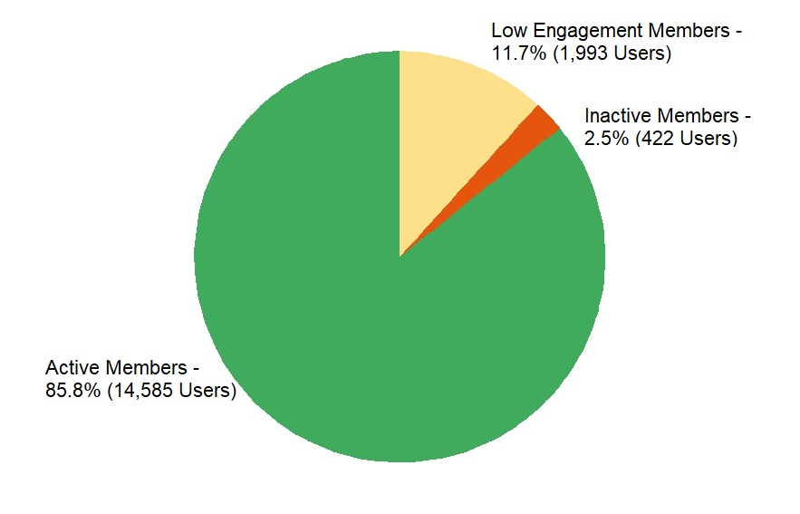
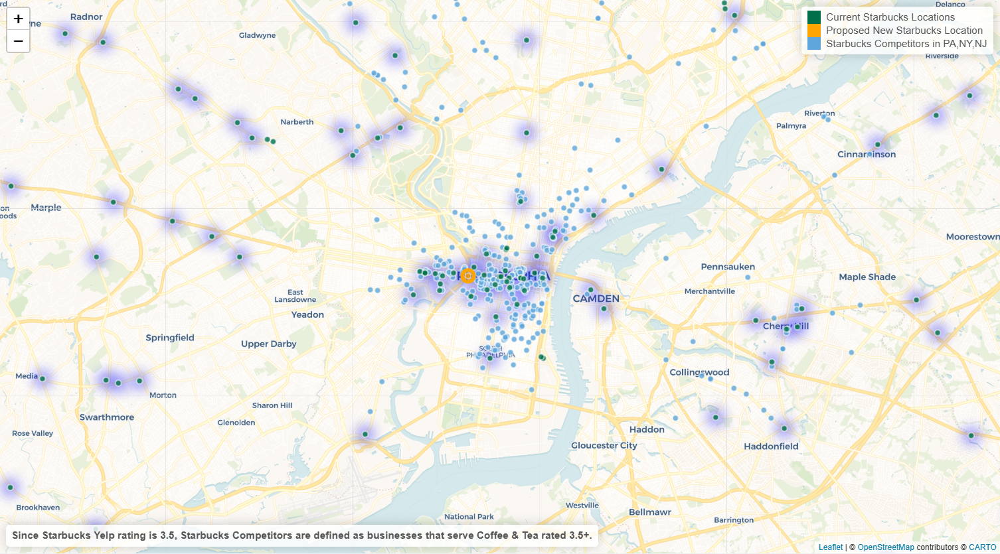

<h1 align="center">Using R Shiny for Geo-Analysis, Low Engagement Insights, & Benchmarking</h1>

Have you ever wondered when a brand shifts from simply being a product to a recurring part of your routine?  Marketing plays an important role in this process of acquiring and retaining customers, and analyzing the impact of marketing campaigns through marketing attribution is key to enhancing marketing strategies. This applies not only to individuals but also to loyal customers. In this project, I utilized the Starbucks Rewards dataset from Kaggle and Starbucks stores’ location data from aggdata.com as of March 2023 to build an R Shiny app that provides comprehensive insights into Starbucks' marketing attribution metrics. Additionally, I will dive into three new insights in more detail: low engagement users, offer time analysis, and the utilization of geo-based data for business expansion strategy.

 

<b>Data Overview and Preparation</b>

<i>Starbucks Marketing Dataset</i>:

The Starbucks reward offers dataset bundle from Kaggle simulates the Starbucks Reward Program and includes 76,277 marketing offers sent to 17,000 users by offer type variant and channel during a 30-day test period.

The dataset is composed of three tables: an event log that tracks user actions such as marketing offers received, viewed, completed, and transactions; user profiles that include age, gender, income, and the date they became a member; and types of reward variants that were sent to users through different channels.

<i>Starbucks Location Dataset</i>:

To identify potential locations for store expansion, I created a heatmap of existing Starbucks locations using data from aggdata.com, a highly regarded source for location data. The dataset contains information on 17,280 Starbucks locations as of March 1st, 2023, across four countries, including the United States, Canada, Puerto Rico, and Mexico. It includes details such as store name, address, city, state, zip code, latitude, and longitude coordinates, as well as other relevant geographic features.

<i>Starbucks Competitors Dataset</i>:

To obtain real-time data on Starbucks' competitors in PA, NJ, and NY, I pull from the Yelp API with a call limit of 1,000 per unique location searched. The results for each state are aggregated together after being retrieved. Due to concerns about the map's loading speed, I do not collect data for all 50 states. For this analysis, I classify businesses that serve coffee or tea and have a Yelp rating of 3.5 or higher as Starbucks' competitors, which is consistent with Starbucks' own rating.

Using Python, I joined the Starbucks reward offers dataset bundle and leveraged ChatGPT to write transformations, create visualizations in R, and collaborate on editing this post.

 

<b>Application</b>

[Marketing Attribution R Shiny app](https://rewardsoffermarketingattribution.shinyapps.io/Rewards_Offer_Marketing_Attribution/)

  

<i>Looking Back: Recap of Three Key Insights from Project I</i>

Let's quickly recap the top three insights from the first project, which include Marketing Offer Ranking, Cohort Analysis, and Response Rates.

1. Marketing Offer Ranking

> The Marketing Offer Ranking leaderboard provides a clear ranking of the marketing offers from highest to lowest response rates and enables users to filter on offer type to reveal that higher duration offers perform better than lower duration offers for both BOGO and discount categories.

2. Cohort Analysis

> Cohorts are segmented based on Starbucks members signup year. This tab compares the total spending in dollars by member signup year with the Average Spend per Member Sign Up Year. This analysis highlights that the 2017 cohort had the highest total spending, and the 2016 cohort had the highest average spend per member.

3. Response Rates

> Response rates are calculated by dividing the number of offers completed by the number of offers received. The dashboard highlights that response rates increase with age and income, and that females are more responsive than males to marketing offers. By including age group, gender, and income group dropdowns, users can easily explore trends within specific segments of interest.

  
<i>Analyzing User Behavior and Geographical Trends: New Insights for Starbucks' Future Success</i>

Now, let's shift the focus to three new insights:

1. Identifying low engagement users based on purchasing below the average order value
2. Analyzing the time distribution between receiving a marketing offer and making a transaction
3. Incorporating geo-based data in selecting the next Starbucks store location
These insights were chosen for their relevance to business success and the need to stay competitive in the market. The first insight proposes a strategy to increase engagement and retention among low engagement users, while the second insight provides a benchmark for measuring the effectiveness of marketing offers or whether new users are exhibiting positive responses. Finally, the third insight explores a geo-based strategy for store expansion to meet customer demand.

 
 
<b>Insight 1: Low Engagement Users

(How to continue maintaining revenue)</b>

It's important to prioritize customer retention as much as new user acquisition, as they both have potential to generate revenue. In the first project, we looked at active versus inactive members.  Active members spent at least some money during the 30-day test period when inactive members spent none.  This time, I'd like to focus on low engagement users – the ones who do spend some money but less than  the average order value.

During the 30-day test period, the average order value was $12.78, calculated by dividing the sum of transactions by the count of transactions. There were 1,993 users who spent less than the average order value, which we'll define as low engagement users.

To incentivize them, we can consider introducing them to new products they may not have tried before, such as limited-time seasonal items or exclusive merchandise. We could also reward them with bonus stars for trying something new. By targeting this group, we can improve their engagement and retention over time.

<b>Insight 2: Time Distribution Between Offer Received and Transaction by User

(How to increase revenue through benchmarking)</b>

In this insight, I will focus on benchmarking to increase revenue by analyzing the time between when a user receives a marketing offer and when they complete a transaction. This metric provides a baseline for the average time it takes for a marketing offer to influence user behavior in a way that positively impacts revenue.

Based on this analysis, it appears that the average time is approximately three days, with a right-skewed distribution indicating that a significant proportion of users make a transaction within one to three days after receiving an offer. From this insight, it is recommended to wait for at least three days before assessing their effectiveness. Additionally, it is advisable to avoid overwhelming customers with too many offers by sending them an offer less than once every three days.

<b>Insight 3: US Starbucks Heatmap as of March 2023

(How to expand the business)</b>

Summarizing the latest [SEC 10-K Filing](https://s22.q4cdn.com/869488222/files/doc_financials/2023/ar/Starbucks-FY22-Annual-Report.pdf) from November 2022, Starbucks' financial results and long-term growth model will be driven by new store openings, comparable store sales, and margin management. The company typically locates its company-operated stores in high-traffic, high-visibility locations and can vary the size and arrangement of its stores to cater to different settings, including downtown and suburban retail centers, office buildings, university campuses, and rural and off-highway locations. Starbucks is expanding its store locations, focusing on drive-thru formats that provide greater access and convenience, as well as alternative store set up that offer a more streamlined customer experience in dense metropolitan areas.

Because Starbucks is a mature US company, it plans to grow strategically by expanding into new locations while closing some [unprofitable](https://www.bloomberg.com/news/articles/2022-07-18/starbucks-ceo-says-more-stores-to-close-for-security-reasons) locations. The company has also shifted its store expansion strategy from [community building to convenience](https://www.adn.com/business-economy/2022/09/23/starbucks-adapts-to-market-changes-with-focus-on-convenience/) to boost growth and increase revenue by 10% to 12% over the next few years. The plan for the next two years includes 35% drive-thru only stores, 14% pickup-only stores, and 5% delivery, while cafes will make up only 2% of all store openings.

 
 
With this context, the business question to answer is: where to open the next Starbucks store?

There are important factors to consider when identifying new locations for expansion The first step is to analyze the concentration of existing Starbucks stores in different areas. In Philadelphia, the heatmap shows that Starbucks stores are currently clustered around City Hall, Center City downtown, and University City, where major universities such as Drexel and the University of Pennsylvania are located.

To ensure success, Starbucks aims to balance brand recognition and consumer demand when selecting new store locations, while also avoiding cannibalizing sales from existing stores. To achieve this, Starbucks often partners with local businesses and real estate developers to secure prime locations and gain insights into local market conditions. For example, Starbucks has positioned one of its stores at [Broad and Washington](https://rebusinessonline.com/post-bros-tower-investments-start-construction-of-750m-multifamily-project-in-south-philadelphia/) where residential and commercial real estate construction is underway.

Accessibility is another key consideration for store location. In Philadelphia, for example, Starbucks strategically places its stores near subway stations to make them easily accessible for commuters. In fact, the latest Starbucks growth strategy includes opening its first Philadelphia pickup only format downtown at [1709 Chestnut](https://headtopics.com/us/starbucks-plans-a-new-center-city-location-with-no-restrooms-or-seating-29668693). This store will be for takeout only and will not have public seating or bathrooms, a store format intended to cater specifically to people on-the-go, such as working professionals and commuters. The store's location in a high foot traffic area, with multiple nearby hotels, further reinforces its appeal to locals and visitors alike looking for a convenient spot to grab their coffee.

 

<i>Decision-making Process for Choosing the Next Starbucks Store Location</i>

When considering where to place the next Starbucks store, I initially thought about placing it near the stadiums where Philadelphia's sports teams (Eagles, Flyers, Sixers, Phillies) play, as well as in the up-and-coming neighborhood of Point Breeze. However, I reconsidered these locations since the stadiums only have games a few times a week. Also, Point Breeze already has direct competition from Batter and Crumbs (also known as the Vegan Starbucks) which opened in 2018.

Ultimately, during a leisurely stroll to the University of Pennsylvania, I found a potential location by the 24th and Chestnut luxury apartments. This location offers high visibility unobstructed by buildings. Situated near a Megabus stop and right off a highway entrance/exit, a take-out, pick-up only store could be a good fit for commuters. It is adjacent to the Schuylkill River Trail, a popular running path for athletes and a convenient refueling spot for those after a workout. In addition, it is close to the Schuylkill Banks, which hosts group yoga, picnics, and summer outdoor movie screenings, making it a potentially high-foot-traffic area.

Overall, opening a Starbucks by Philadelphia’s 24th and Chestnut luxury apartments could potentially be a lucrative location with high foot traffic and convenient accessibility for commuters and fitness enthusiasts. Starbucks could partner with the real estate management and local businesses in the area to gain insight into the local market conditions and confirm the practicality of opening a store in this location.

  

<b>Recap and Recommendation</b>

In summary, the three insights for Starbucks strategy are:

1. Low engagement users should be prioritized as a retention strategy. An approach is to encourage and incentivize them to try new products or seasonal food and beverages (such as the Paradise Drink or Kale and Mushroom Egg Bites), which can help them discover and appreciate the range of offerings that Starbucks provides.
2. The average time between receiving a marketing offer and making a purchase is approximately three days, with a good proportion of actions taking place between 1-3 days. This finding suggests that it is best to wait for a minimum of three days before evaluating the effectiveness of marketing offers. Moreover, to prevent customers from being overwhelmed with excessive offers, it is recommended to send offers no more than once every three days.
3. Starbucks is prioritizing the expansion of its store locations with a focus on drive-thrus, pick-up, and delivery options over the next two years. The company is targeting areas with high customer accessibility and convenience. I recommend a new store location by 24th and Chestnut with high foot traffic and convenient accessibility for commuters and fitness enthusiasts, who may be content with a take-out only store setup. Starbucks can partner with local real estate development to validate if this is a practical and potentially lucrative venture.
 
 
<b>Future Work to Enhance R Shiny</b>

If more time were available, here are some features that we could implement to improve the R Shiny dashboard.

1. A slider could be added to the member pie chart to enable users to dynamically adjust the transaction value that defines low engagement. Currently, low engagement users are defined as users that spend less than an Average Order Value of $12.78, but the slider would allow users to explore how changing this value affects the number and percentage of low-engagement users.
2. Another potential enhancement would be to add a gender and/or age segment dropdown to the average time between offer received and transaction visualization, which would allow users to investigate whether the average time varies by demographic category.
3. To enhance the existing Starbucks heatmap and identify neighborhoods that may be receptive to the new take-out-only store model, US census data on population density, growth, and other indicators of promising locations can be overlaid onto it. Furthermore, incorporating Yelp data can assist in identifying areas with existing business competition, such as bakeries and coffee shops, which can help determine whether a new Starbucks store should be built in that area.
  

In conclusion, this is part II of this project, which presents comprehensive marketing attribution metrics through an R Shiny dashboard to help business leaders focus on strategy and outcomes. The next steps are to overlay US Census and Yelp data onto the existing heatmap using their respective APIs. Stay tuned!
